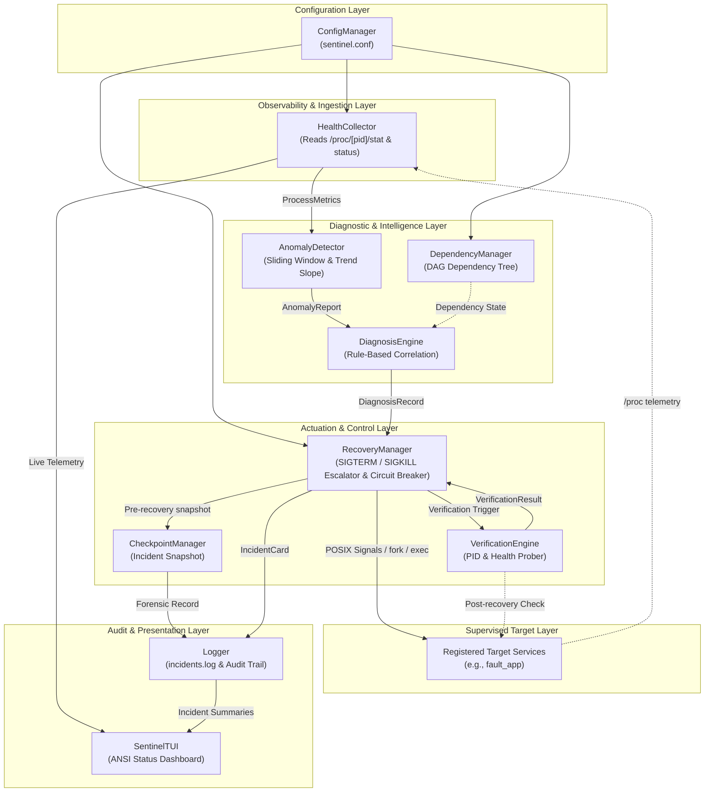
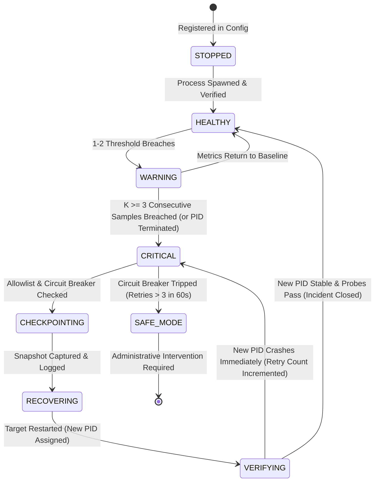
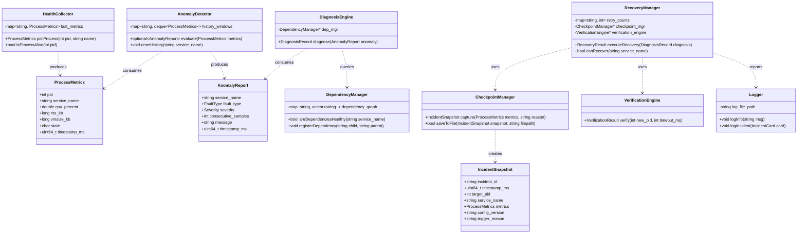

# Stage 3 — System Architecture & Design Specification

**Project Name:** Linux Sentinel: Predictive Failure Detection & Safe-Recovery Orchestrator  
**Version:** 1.0.0-PROD  
**Target Platform:** Embedded Linux (POSIX User-Space)  
**Implementation Standard:** Modern C++ (C++17)  
**Stage Alignment:** Stage 3 — Architecture, UML & Data Structures  

---

## 1. System Block Diagram & Subsystem Boundaries

Linux Sentinel is partitioned into decoupled subsystems, each adhering to the Single Responsibility Principle (SRP). Communication between modules is mediated by strongly typed data contracts defined in [`include/Common.h`](file:///Users/maa/Desktop/Project/linux-sentinel/include/Common.h).



---

## 2. Module Responsibilities & Call Hierarchy

| Subsystem / Class | Responsibility | Upstream Caller | Downstream Callees |
|---|---|---|---|
| **`ConfigManager`** | Parses `sentinel.conf`, validates allowlisted services, thresholds, and DAG relationships. | `main()` | All Subsystems |
| **`HealthCollector`** | Non-invasively reads `/proc/[pid]/stat` and `/proc/[pid]/status`. Calculates differential CPU% and RSS. | `main()` Event Loop | Linux Virtual Filesystem |
| **`AnomalyDetector`** | Maintains circular sliding windows of telemetry. Detects continuous rate-of-change $\frac{\Delta \text{Mem}}{\Delta t}$ and CPU spikes. | `main()` Event Loop | None (returns `AnomalyReport`) |
| **`DependencyManager`** | Evaluates Directed Acyclic Graph (DAG) states. Resolves cascade blocks (e.g., `App -> Backend -> DB`). | `main()` Event Loop | None (returns graph state) |
| **`DiagnosisEngine`** | Correlates anomalies with dependencies using deterministic rules to pinpoint root causes. | `main()` Event Loop | `AnomalyDetector`, `DependencyManager` |
| **`CheckpointManager`** | Creates immutable pre-recovery incident snapshots containing PID, args, telemetry, and timestamps. | `RecoveryManager` | Local Filesystem (`logs/`) |
| **`RecoveryManager`** | Enforces circuit breakers, coordinates tiered signal escalation (`SIGTERM` $\to$ `SIGKILL`), and respawns tasks. | `main()` Event Loop | `CheckpointManager`, `VerificationEngine`, Target |
| **`VerificationEngine`** | Validates post-restart runtime health across a 2-second stabilization window. | `RecoveryManager` | Target Process (`/proc/[new_pid]`) |
| **`Logger`** | Records human-readable audit trails and structured JSON incident cards. | All Subsystems | `logs/incidents.log`, `stdout` |

---

## 3. Subsystem Interaction Sequence Diagram

The following sequence represents a complete closed-loop lifecycle when a target process encounters a progressive memory exhaustion fault:

```mermaid
sequenceDiagram
    autonumber
    participant Target as fault_app (PID 1024)
    participant HC as HealthCollector
    participant AD as AnomalyDetector
    participant DE as DiagnosisEngine
    participant CP as CheckpointManager
    participant RM as RecoveryManager
    participant VE as VerificationEngine
    participant Log as Logger

    loop Every 1000ms Polling Interval
        HC->>Target: Poll /proc/1024/stat & status
        Target-->>HC: Telemetry (CPU, RSS, State)
        HC->>AD: Submit ProcessMetrics
        AD->>AD: Push to circular window; evaluate slope
    end

    Note over AD: 3 consecutive samples show positive slope (Mem growth > threshold)
    AD->>DE: Emit AnomalyReport (MEMORY_GROWTH)
    DE->>DE: Evaluate dependencies (DB & API healthy)
    DE->>RM: Issue DiagnosisRecord (OOM_RISK -> Action: GRACEFUL_RESTART)

    RM->>RM: Check Circuit Breaker (attempt 1 of 3 -> PERMITTED)
    RM->>CP: captureSnapshot(PID 1024, Metrics, Config)
    CP->>Log: Write Snapshot to Audit Trail

    RM->>Target: sendSignal(SIGTERM)
    Note over Target,RM: Await termination up to 3s grace timeout
    Target-->>RM: Process terminates (or SIGKILL if timeout expires)
    RM->>RM: reapZombie(waitpid)
    
    RM->>Target: fork() + execvp() [Respawn target]
    Note right of Target: New Process spawned (PID 2048)

    RM->>VE: verifyRecovery(PID 2048, BaselineSpec)
    loop Stabilization Window (2000ms)
        VE->>Target: Poll /proc/2048/status
        Target-->>VE: State == RUNNING, RSS == Normal
    end
    VE-->>RM: VerificationResult(SUCCESS, new_pid=2048)

    RM->>Log: logIncident(INC-0001, SUCCESS, Duration=2.1s)
    RM->>RM: Reset Circuit Breaker timer
```

---

## 4. State Machine Diagram

Each monitored service is governed by a formal finite state machine (FSM) to prevent illegal state transitions and infinite restart loops:



---

## 5. Class Diagram & Object-Oriented Structure


